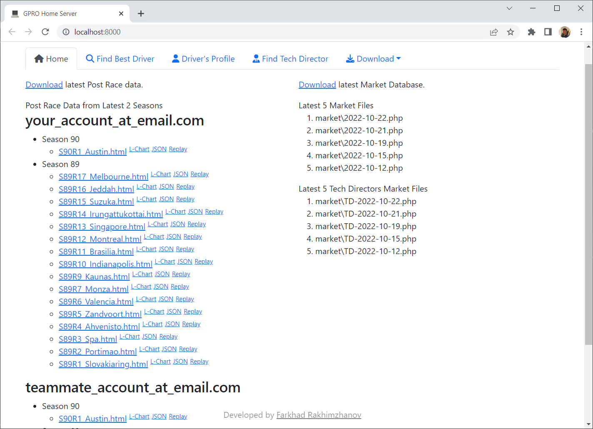
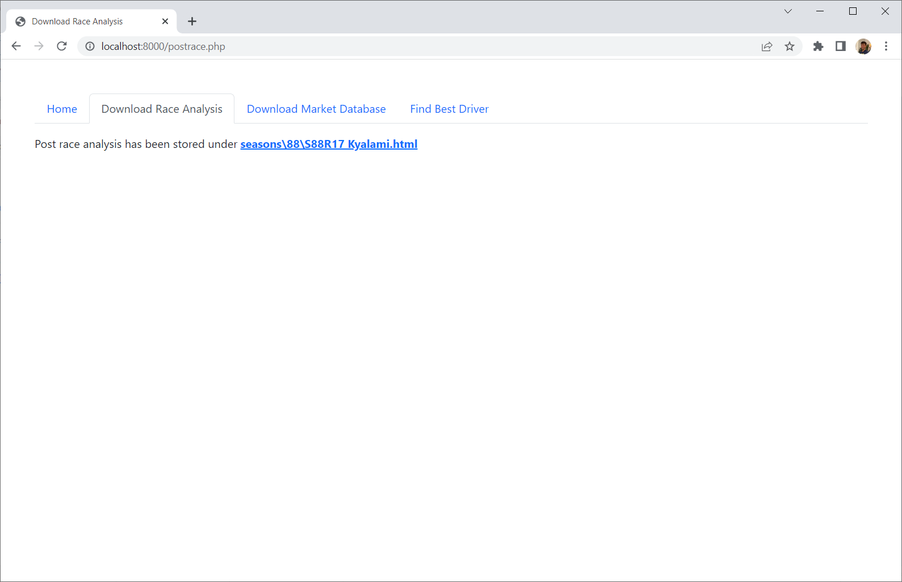
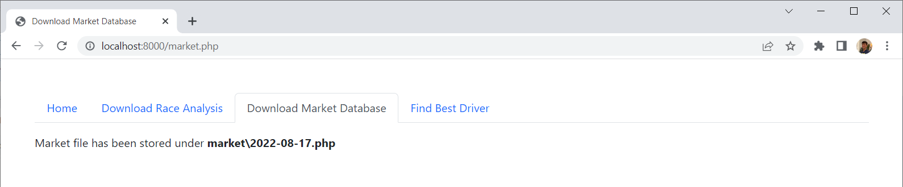
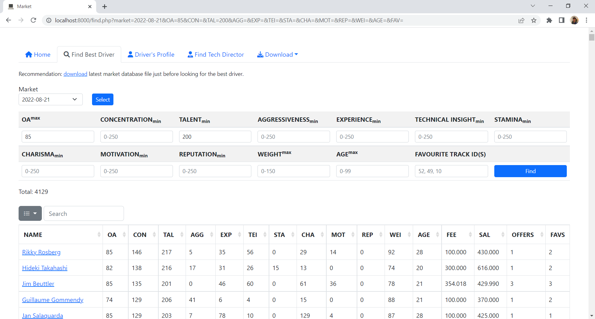

# [Grand Prix Racing Online](https://www.gpro.net) Home Server

## Requirements
- PHP 8
- Composer

## Installation
`composer install`

## Configuration
Rename `config.example.php` to `config.php`

## Usage
Start local web-server `php -S localhost:8000`
- http://localhost:8000/ Home page
- http://localhost:8000/postrace.php Download latest Race Analysis html file
- http://localhost:8000/market.php Download latest drivers market database file
- http://localhost:8000/find.php Find best driver on the market

## Screenshots
### Download Race Analysis

### Download Market Database

### Find Best Driver

