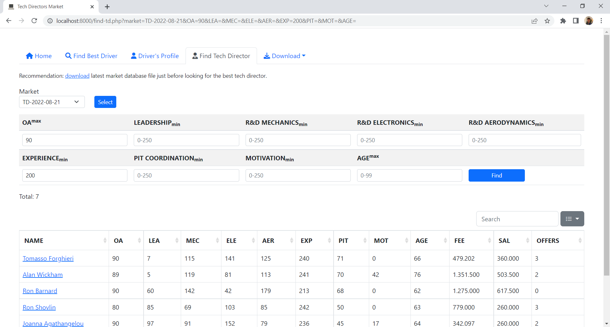
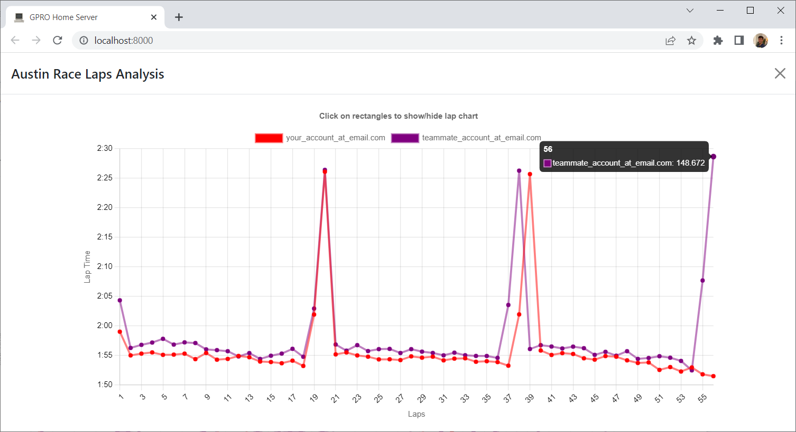

# [Grand Prix Racing Online](https://www.gpro.net) Home Server

## Features
- Automatically download Post Race Data
  - Race Analysis in HTML/JSON format
  - Light Race Replay in HTML format
  - Staff & Facilities in HTML/JSON format
  - Sponsors in HTML/JSON format
  - Testing in HTML/JSON format
- Sponsors Progress Overviewnew
- Race Laps Analysis (L-Chart)updated 
- CCP, S&F, Sponsors in JSON file
- Keep track of Drivers & Tech Directors Market Database
- Find Best Driver incl. by Favourite Track
- View Driver's Profile
- Find Tech Director

## Requirements
- Microsoft Windows 7 or higher
- Installed PHP 8 or higher ([Download](https://windows.php.net/download))
- Installed Composer 2 or higher ([Download](https://getcomposer.org/doc/00-intro.md#installation-windows))

## Installation
- Download [GPRO Home Server](https://github.com/farkhad/gpro/archive/refs/heads/main.zip) zip
- Extract zip to preferred *GPRO Home Server* folder
- Navigate to *GPRO Home Server* folder and run terminal command `composer install`

## Update
- Make backup of *GPRO Home Server* folder
- Download [GPRO Home Server](https://github.com/farkhad/gpro/archive/refs/heads/main.zip) zip
- Extract zip to *GPRO Home Server* folder
- Navigate to *GPRO Home Server* folder and run terminal command `composer install`

## Configuration
- Rename `config.example.php` to `config.php`
  - updatedOpen `config.php` with Notepad, set `FOLDER_NAME` (&rarr; *GPRO Home Server/seasons/**FolderName***), `USERNAME`, `PASSWORD` 
- Rename `homeserver.example.bat` to `homeserver.bat`, and `postrace.example.bat` to `postrace.bat`
  - Open `postrace.bat`, `homeserver.bat` with Notepad
    - Set path to *GPRO Home Server* folder
    - Setup [Windows Task Scheduler](https://en.wikipedia.org/wiki/Windows_Task_Scheduler) to run `postrace.bat` after every race

## Usage
### Automatically
- Launch `homeserver.bat` 

When you are finished working on *GPRO Home Server*, press `CTRL+C` and type `Y` in the opened terminal window
- Launch `postrace.bat` after every race &mdash; it will download post race data. 

Alternatively, setup Windows Task Scheduler to run `postrace.bat` after every race.

### Manually
Navigate to *GPRO Home Server* folder and run terminal command `php -S localhost:8000`
- http://localhost:8000/ Home page
- http://localhost:8000/postrace.php Download latest Race Analysis html file
- http://localhost:8000/market.php Download latest market database file
- http://localhost:8000/find.php Find best driver
- http://localhost:8000/profile.php Find driver's profile
- http://localhost:8000/find-td.php Find tech director

## Screenshots
### Download Post Race Data

### Download Market Database

### Find Best Driver

### Find Driver's Profile

### Find Tech Director

### L-Chart

