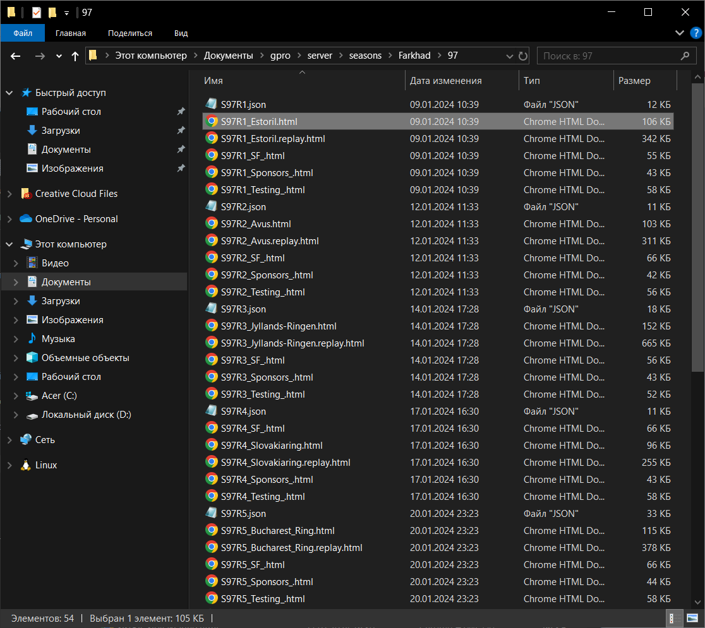
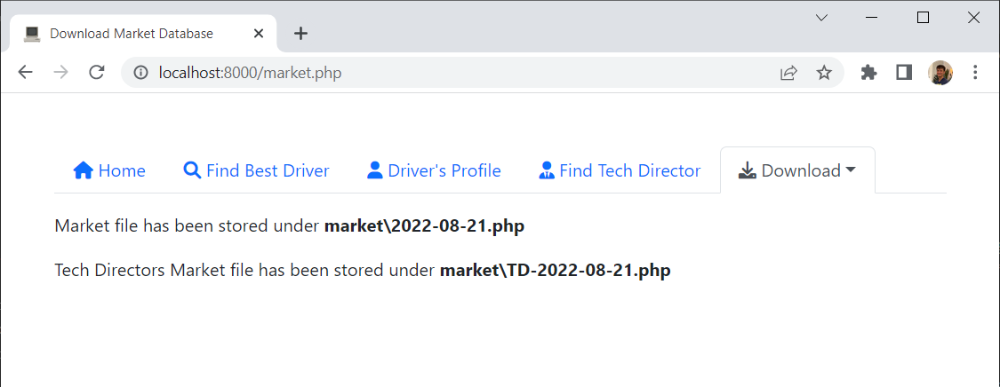
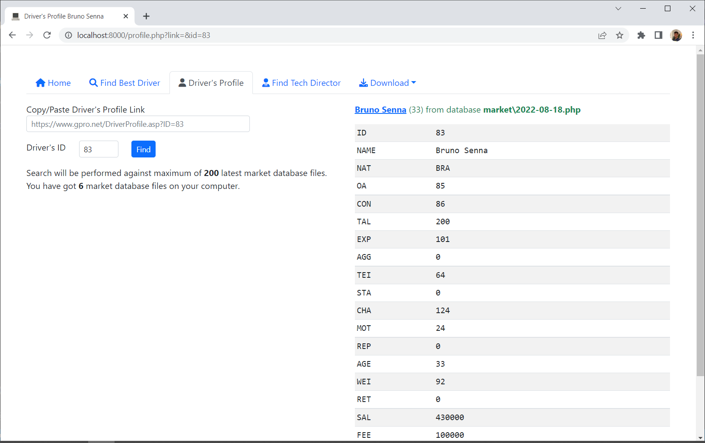
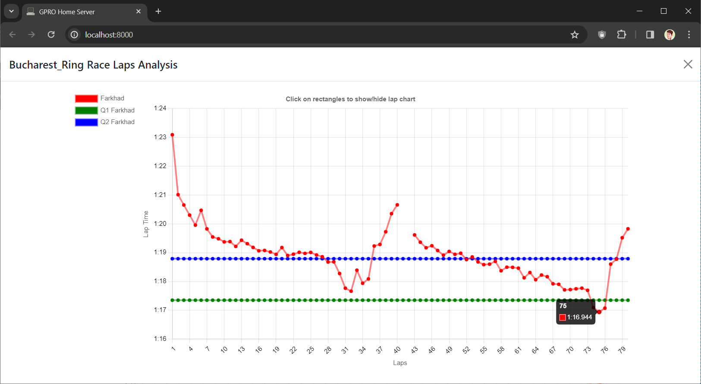

# [Grand Prix Racing Online](https://www.gpro.net) Home Server

Helps you to make use of your game historical data.  
[Send me PM](https://gpro.net/NewMail.asp?IDM=931390) at gpro.net if you have any questions, suggestions, and/or ideas!

## Features
- Season Dashboard
  - Weather 
  - Energy
  - Risks
  - Balance
  - Sponsors
  - Driver
  - Staff & Facilities 
- Next Race Overview
  - Energy History
  - Median Elite Race Time
- Post Race Data in HTML/JSON formats
  - Race Analysis
  - Light Race Replay
  - Staff & Facilities
  - Sponsors
  - Testing
- Race Laps Analysis (L-Chart)
- Keep track of Drivers & Tech Directors Market Database
- Find Best Driver incl. by Favourite Track
- View Driver's Profile
- Find Tech Director

All your post race data files are stored on your computer as a set of HTML and JSON files
and can be accessed in a usual way using Windows Explorer

## Requirements
- Microsoft Windows 7 or higher
- PHP 8 or higher ([Installation Guide](https://docs.google.com/document/d/1gE-fRv-ntlaiOILRcvGxTwULfOTe06qY4EOy9cFphbE/edit?usp=sharing))
- Composer 2 or higher ([Installation Guide](https://getcomposer.org/doc/00-intro.md#installation-windows))

## Installation
- Download [GPRO Home Server](https://github.com/farkhad/gpro/archive/refs/heads/main.zip) zip
- Extract zip to preferred *GPRO Home Server* folder
- Navigate to *GPRO Home Server* folder by following these steps
  - press `WIN + R` on your keyboard
  - enter `cmd`,
  - press `OK`,
  - enter `cd C:\Users\user\Documents\gpro\server` (change path to your own)  
  then run these commands
  - enter `composer install` 
  - enter `php sync.php`

## Update
- Make backup of *GPRO Home Server* folder
- Download [GPRO Home Server](https://github.com/farkhad/gpro/archive/refs/heads/main.zip) zip
- Extract zip to *GPRO Home Server* folder
- Navigate to *GPRO Home Server* folder by following these steps
  - press `WIN + R` on your keyboard
  - enter `cmd`,
  - press `OK`,
  - enter `cd C:\Users\user\Documents\gpro\server` (change path to your own)  
  then run these commands
  - enter `composer install` 
  - enter `php sync.php`

## Configuration
- Rename `config.example.php` to `config.php`
  - Open `config.php` with Notepad and set values for
    - `FOLDER_NAME` - folder which will be created under *GPRO Home Server/seasons*
    - `USERNAME` - GPRO username for limited access
    - `PASSWORD` - GPRO password for limited access
- Rename `homeserver.example.bat` to `homeserver.bat`, and `postrace.example.bat` to `postrace.bat`
  - Open `postrace.bat`, `homeserver.bat` with Notepad
    - Set path to *GPRO Home Server* folder
    - (Optional) Setup [Windows Task Scheduler](https://en.wikipedia.org/wiki/Windows_Task_Scheduler) to run `postrace.bat` after every race

## Usage
### Automatically
- Launch `homeserver.bat`, it will bootstrap your local web-server and open default browser window  
If browser shows error, then wait for 1-3 minutes and refresh the page

When you are finished working on *GPRO Home Server*, press `CTRL+C` and type `Y` in the opened terminal window
- Launch `postrace.bat` after every race &mdash; it will download post race data. 

Alternatively, setup Windows Task Scheduler to run `postrace.bat` after every race.

### Manually
Navigate to *GPRO Home Server* folder and run console command `php -S localhost:8000`
- http://localhost:8000/ Home page
- http://localhost:8000/postrace.php Download latest Post Race data
- http://localhost:8000/market.php Download latest Market Database
- http://localhost:8000/find.php Find best driver
- http://localhost:8000/profile.php Find driver's profile
- http://localhost:8000/find-td.php Find tech director

## Screenshots
### Download Post Race Data

### Download Market Database

### Find Best Driver

### Find Driver's Profile

### Find Tech Director

### L-Chart

