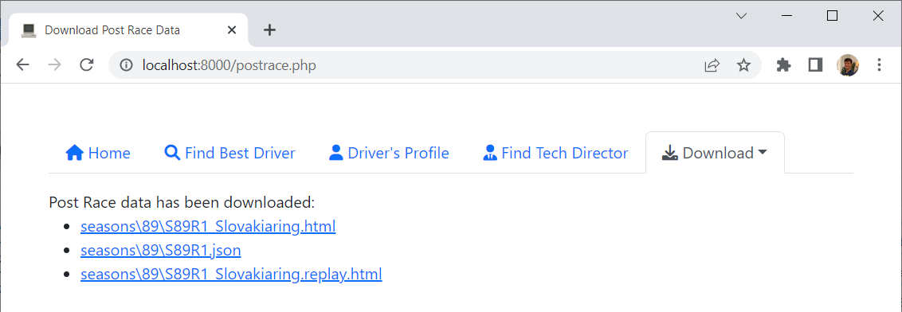

# [Grand Prix Racing Online](https://www.gpro.net) Home Server

## Features
- Automatically download post Race Analysis as HTML file
- Keep track of Drivers Market Database
- Find Best Driver incl. by Favourite Track
- Find Driver's Profile

## Requirements
- Microsoft Windows 7 or higher
- Installed PHP 8 or higher ([PHP for Windows](https://windows.php.net/download))
- Installed Composer 2 or higher ([Installation Windows](https://getcomposer.org/doc/00-intro.md#installation-windows))

## Installation
- Download [GPRO Home Server](https://github.com/farkhad/gpro/archive/refs/heads/main.zip) zip
- Extract zip to preferred *GPRO Home Server* folder
- Navigate to *GPRO Home Server* folder and run terminal command `composer install`

## Configuration
- Rename `config.example.php` to `config.php`
  - Open `config.php` with Notepad, set `USERNAME` & `PASSWORD`
- Open `postrace.bat`, `homeserver.bat` with Notepad
  - Set path to *GPRO Home Server* folder
  - Setup Windows Scheduler to run `postrace.bat` after every race

## Usage
### Automatically
Launch `homeserver.bat` 

When you are finished working on *GPRO Home Server*, press `CTRL+C` and type `Y` in the opened terminal window

### Manually
Navigate to *GPRO Home Server* folder and run terminal command `php -S localhost:8000`
- http://localhost:8000/ Home page
- http://localhost:8000/postrace.php Download latest Race Analysis html file
- http://localhost:8000/market.php Download latest market database file
- http://localhost:8000/find.php Find best driver
- http://localhost:8000/profile.php Find driver's profile

## Screenshots
### Download Race Analysis

### Download Market Database

### Find Best Driver

### Find Driver's Profile

