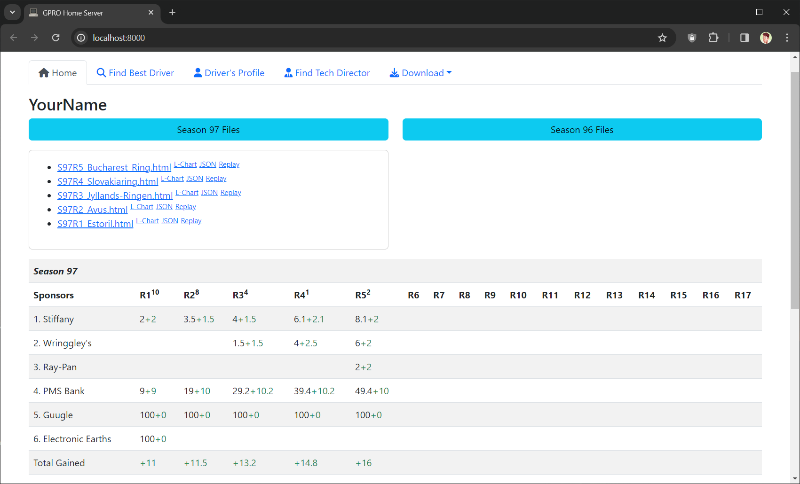

# [Grand Prix Racing Online](https://www.gpro.net) Home Server

## Requirements
- PHP 8 ([PHP for Windows](https://windows.php.net/download), pick zip `Thread Safe` version)
- Composer ([Installation Windows](https://getcomposer.org/doc/00-intro.md#installation-windows))

## Installation
- Download GPRO Home Server zip from https://github.com/farkhad/gpro/archive/refs/heads/main.zip
- Extract zip to preferred folder
- From GPRO Home Server folder run terminal command
`composer install`

## Configuration
- Rename `config.example.php` to `config.php`, open `config.php` with Notepad, and setup `USERNAME` and `PASSWORD`
- Open `postrace.bat` with Notepad, change path, setup Windows Scheduler to run `postrace.bat` after every race
- Open `homeserver.bat` with Notepad, change path

## Usage
### Automatically
Launch `homeserver.bat`. When you are finished working on Home Server, press `CTRL+C` and type `Y` in the opened terminal window

### Manually
Navigate to folder where GPRO Home Server files reside

Start local web-server by typing `php -S localhost:8000` in your terminal window
- http://localhost:8000/ Home page
- http://localhost:8000/postrace.php Download latest Race Analysis html file
- http://localhost:8000/market.php Download latest drivers market database file
- http://localhost:8000/find.php Find best driver on the market

## Screenshots
### Download Race Analysis

### Download Market Database

### Find Best Driver

